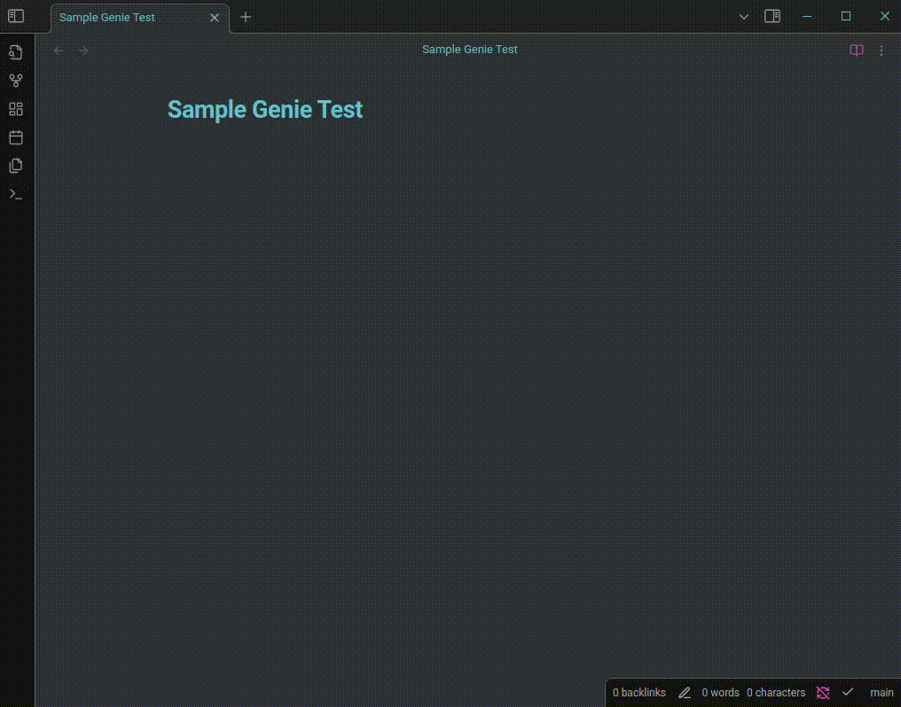

# Obsidian Genie Plugin

This is a plugin for Obsidian based on (https://github.com/obsidianmd/obsidian-sample-plugin).




### Installation

This is manual for now. 

- Clone the repository in the `.obsidian/plugins` folder.

- in the project directory run
```
npm install
npm run build
```

- Go to Community Plugins and enable the plugin.

- Add your openai api key in the plugin settings.
